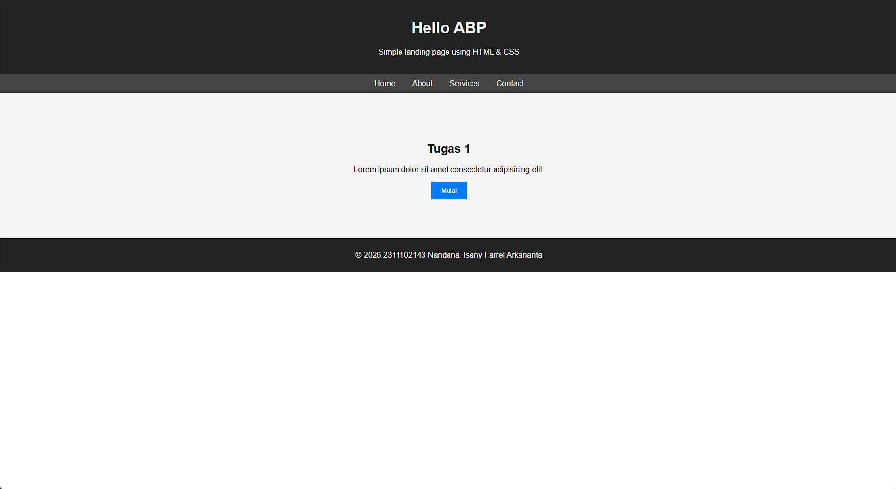

# MODUL 2,3,4  
## Pembuatan Landing Page Menggunakan HTML dan CSS

---

## Soal / Kasus

Membuat sebuah tampilan **home page / landing page website** menggunakan **HTML dan CSS** tanpa batasan warna, layout, maupun isi konten.  

Halaman ini bertujuan untuk menampilkan informasi utama dari sebuah website seperti **judul, deskripsi, navigasi menu, serta tombol aksi** yang dapat digunakan oleh pengguna.

---

## Code

### index.html

```html
<!DOCTYPE html>
<html>
<head>
    <title>My Landing Page</title>
    <link rel="stylesheet" href="style.css">
</head>

<body>

<header>
    <h1>Welcome to My Website</h1>
    <p>Simple landing page using HTML & CSS</p>
</header>

<nav>
    <a href="#">Home</a>
    <a href="#">About</a>
    <a href="#">Services</a>
    <a href="#">Contact</a>
</nav>

<section class="hero">
    <h2>Create Your Future</h2>
    <p>Learn web development from scratch.</p>
    <button>Get Started</button>
</section>

<footer>
    <p>© 2026 My Website</p>
</footer>

</body>
</html>
```


### style.css

```css
body{
    font-family: Arial;
    margin:0;
}

header{
    background:#222;
    color:white;
    text-align:center;
    padding:20px;
}

nav{
    background:#444;
    text-align:center;
    padding:10px;
}

nav a{
    color:white;
    margin:15px;
    text-decoration:none;
}

.hero{
    text-align:center;
    padding:80px;
    background:#f4f4f4;
}

button{
    padding:10px 20px;
    background:#007bff;
    color:white;
    border:none;
}

footer{
    text-align:center;
    background:#222;
    color:white;
    padding:10px;
}
```

### Screenshot Output


### Penjelasan Code dan Output (Korelasi)
Pada program ini digunakan HTML sebagai dasar untuk menyusun struktur halaman website, sedangkan CSS digunakan untuk mengatur tampilan agar halaman terlihat lebih rapi dan menarik.

File index.html berfungsi sebagai kerangka utama dari website. Di dalam file tersebut terdapat beberapa elemen seperti header, nav, section, dan footer. Bagian header digunakan untuk menampilkan judul atau identitas dari website. Selanjutnya terdapat bagian nav yang berisi menu navigasi seperti Home, About, Services, dan Contact yang dapat digunakan pengguna untuk berpindah ke bagian halaman lainnya.

Kemudian terdapat elemen section dengan class hero yang berfungsi sebagai bagian utama dari landing page. Pada bagian ini ditampilkan judul utama, deskripsi singkat mengenai website, serta tombol aksi yang dapat menarik perhatian pengguna.

File style.css digunakan untuk mengatur tampilan visual dari halaman tersebut, seperti pengaturan warna latar belakang, jenis font, jarak antar elemen (padding), serta posisi teks. Dengan menggunakan CSS, tampilan halaman menjadi lebih terstruktur dan nyaman untuk dilihat.

Hasil dari program ini adalah sebuah halaman landing page sederhana yang menampilkan struktur dasar website dengan tampilan yang sudah diatur menggunakan CSS sehingga terlihat lebih rapi dibandingkan jika hanya menggunakan HTML saja.
